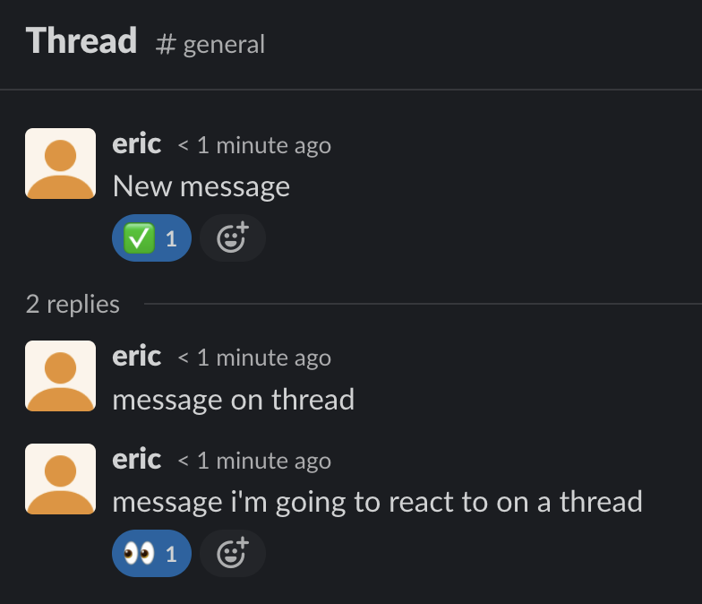

# SlackBot Example

## Data Prep

```sql
copy(
    select
      type              ,
      subtype           ,
      to_timestamp(cast(ts as bigint)) as ts,
      user              ,
      text              ,
      -- client_msg_id     ,
      -- blocks            ,
      team              ,
      user_team         ,
      source_team       ,
      user_profile      ,
      inviter           ,
      edited            ,
      reactions         ,
      thread_ts         ,
      reply_count       ,
      reply_users_count ,
      latest_reply      ,
      -- reply_users       ,
      -- replies           ,
      is_locked         ,
      subscribed        ,
      last_read         ,
      parent_user_id    ,
      regexp_extract(filename, 'data/iloveai-initial-export/(.+)/\d{4}-\d{2}-\d{2}.json', 1) as channel
    from (
        select * from read_json_auto('data/iloveai-initial-export/*/*.json',
            format='array',
            filename=true,
            union_by_name=true)
    )
) to 'messages.parquet' (FORMAT PARQUET)
;

    select
    from (
        select * from read_json_auto('data/iloveai-initial-export/*/*.json',
            format='array',
            filename=true,
            union_by_name=true)
    )
    limit 10
;
```

## Event Structure

### From Live Events



For the above thread, these are the summarized events:

```json
[{'type': 'message', 'text': 'New message', 'user': 'U05JQJJDJ6P', 'ts': '1691224144.675049', 'team': 'T05JA5XCR9D', 'channel': 'C05KED4JDNC', 'event_ts': '1691224144.675049'}]
[{'type': 'reaction_added', 'user': 'U05JQJJDJ6P', 'reaction': 'white_check_mark', 'item.type': 'message', 'item.channel': 'C05KED4JDNC', 'item.ts': '1691224144.675049', 'event_ts': '1691224146.001000'}]
[{'type': 'message', 'text': 'message on threa', 'user': 'U05JQJJDJ6P', 'ts': '1691224168.728139', 'team': 'T05JA5XCR9D', 'thread_ts': '1691224144.675049', 'channel': 'C05KED4JDNC', 'event_ts': '1691224168.728139'}]
[{'type': 'message', 'text': "message i'm going to react to on a thread", 'user': 'U05JQJJDJ6P', 'ts': '1691224179.912759', 'team': 'T05JA5XCR9D', 'thread_ts': '1691224144.675049', 'channel': 'C05KED4JDNC', 'event_ts': '1691224179.912759'}]
[{'type': 'reaction_added', 'user': 'U05JQJJDJ6P', 'reaction': 'eyes', 'item.type': 'message', 'item.channel': 'C05KED4JDNC', 'item.ts': '1691224179.912759', 'event_ts': '1691224186.001300'}]
```

From this, we learn:
* The primary key for a specific message is `channel` + `event_ts`
* On a reaction, the `item.channel` and `item.ts` point to the message the reaction is for
* On a thread, the `thread_ts` indicates the original message `event_ts` that started the thread

### From Historical Dump

```json
{"ts":1626218075.2842,"user":"UCZ4VJF6J","text":"Initial Message","reactions":null,"thread_ts":1626218075.2842,"reply_users":["UU5C7MNMA","UCZ4VJF6J","U017T5TFW58"],"channel":"dev-ops"}
{"ts":1626218121.2843,"user":"UU5C7MNMA","text":"Message on thread","reactions":null,"thread_ts":1626218075.2842,"reply_users":null,"channel":"dev-ops"}
{"ts":1626218141.2845,"user":"UCZ4VJF6J","text":"Another message on thread","reactions":null,"thread_ts":1626218075.2842,"reply_users":null,"channel":"dev-ops"}
{"ts":1626218168.2847,"user":"UU5C7MNMA","text":"Message on thread with reaction","reactions":[{"name":"100","users":["U017T5TFW58"],"count":1}],"thread_ts":1626218075.2842,"reply_users":null,"channel":"dev-ops"}
{"ts":1626275919.2858,"user":"UU5C7MNMA","text":"Standard Message","reactions":null,"thread_ts":null,"reply_users":null,"channel":"dev-ops"}
{"ts":1626289719.2927,"user":"U017T5TFW58","text":"Last mesage on thread","reactions":null,"thread_ts":1626218075.2842,"reply_users":null,"channel":"dev-ops"}
```

From this we learn:
* In historical, reactions are attached to thier messages
* All messages on a specific thread have the `thread_ts` set.  Including the initial message!
  * The initial message also has a `reply_users` property, which contains the set of unique users that replied on the thread.

## Analysis

In order to perform analysis on a conversation, we first need to break up the data stream into "conversations".

Hypothesis:
* A slack "converstation" in a specific channel cconsists of either:
  * A thread
  * A collection of messages that occur in succession. If no response is made for 5 minutes, the conversation has ended. The next message outside this window is the start of a new conversation.


